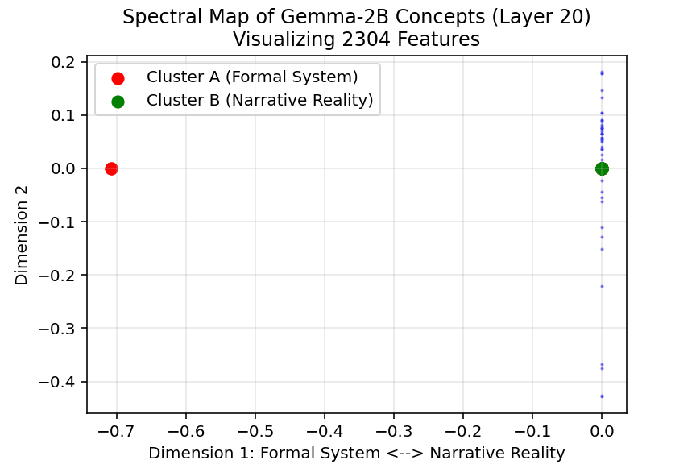

# **Spectral Topography of the Gemma-2-2B Residual Stream**

## Topography of Semantic Concepts in Layer 20

## Abstract
This project maps the semantic topography of Gemma-2-2B's residual stream at Layer 20 using spectral clustering. The analysis reveals a fundamental axis of representation that divides **"Formal Structure & Artificial Syntax" (Cluster A)** from **"Narrative Reality & Subjective Experience" (Cluster B)**. 

Steering experiments confirm this topology is functional: injecting the "Formal" vector forces the model into academic, scientific, or digital syntax modes, while suppressing it reduces the model to unorganized sensory perception.

## 1. Experimental Setup
* **Target Model:** `google/gemma-scope-2b-pt-res-canonical` (Gemma 2 2B Base Model, Pre-trained).
* **Analysis Target:** The Residual Stream at **Layer 20** (mid-to-late layer, associated with abstract semantic integration).
* **Interpretability Tool:** A Sparse Autoencoder (SAE) with **16,384 latent features** (Expansion Factor $\approx$ 7x).
* **Methodology:** Spectral Clustering (Laplacian Eigendecomposition) on Sparse Autoencoder (SAE) Features (via a Cosine Similarity Adjacency Matrix)

## 2. Core Discovery: The "Structure-Substance" Manifold
The primary spectral dimension (Fiedler Vector) of Layer 20 does not divide concepts along a simple "Technical vs. Non-Technical" axis. Instead, it appears to reveal a fundamental split between **Formal Schematic and Structural Systems** and **Narrative Reality and Subjective Experience**. Analysis of the feature adjacency matrix reveals two distinct poles:

### Cluster A (Negative Pole of the Fiedler Vector): "Formal Structure & Artificial Syntax"
* **Nature:** Concepts governed by rigid rules, strict syntax, or coordinate systems.
* **Key Features Identified:** XML/HTML tags, Mathematical Equations, Urban Zoning, Academic Citations, Citations (`i.e.`).
* **Observation:** "Real world" concepts like Urban Planning may appear here because they are represented as *systems* (Zones, Sectors) rather than *stories*.

### Cluster B (Positive Pole of the Fiedler Vector): "Narrative Reality & Subjective Experience"
* **Nature:** Concepts defined by fluid human interaction, temporal events, and prose.
* **Key Features Identified:** Legal Procedure, History, Interpersonal Dialogue, Physical Movement, Emotional Description.
* **Observation:** "Technical" human concepts (like Law) may appear here because they are constructed through natural language narrative rather than rigid syntax.

## 3. Geometric Anomaly: The "Formal Singularity"
A critical topological finding is the geometric density of Pole A.

* **The Observation:** In the first two spectral dimensions, Pole B (Narrative) displays significant vertical spread, indicating a diverse internal structure. In contrast, Pole A (Structure) collapses into a near 0-dimensional point (a singularity).
* **Interpretation:** The model’s internal representation of "Structure" (Math, Code, Citations) is hyper-connected and extremely dense. To the model, these concepts are mathematically almost identical in their rigidity, whereas "Narrative" concepts allow for a wide range of "soft" relationships.

<p align="center">
  
</p>

## 4. Experimental Verification (Steering)

To validate the map, I extracted the mean vector of Cluster A and steered the model's generation (`coeff +/- 150`). The results demonstrate three distinct effects of this "Formal Structure" axis.

### Experiment I: The Philosophical Split (Deterministic)
*Prompt: "The chemistry of love is"* (Temp = 0)

| Steering | Output Snippet | Analysis |
| :--- | :--- | :--- |
| **-150 (Suppressed)** | *"The chemistry of love is a complex one. It is a combination of physical attraction, emotional connection, and the **desire to be with someone**. It is a **feeling** that can be both **exhilarating and overwhelming**. It is a **feeling** that..."* | **Subjective Experience.** The model defines the concept through internal human feelings and personal connection. |
| **Control** | *"The chemistry of love is a complex one. It is a mixture of emotions, feelings, and physical attraction. It is a **feeling** that can be both **exhilarating and overwhelming**. It is a **feeling** that can make you **feel** like you..."* | **Subjective Experience.** Similar to the suppressed output, the model defines the concept through internal human feelings and personal connection. |
| **+150 (Encouraged)** | *"The chemistry of love is a complex and fascinating subject. It is a topic that has been **studied by scientists** and **philosophers** for centuries. The chemistry of love is the **study of the chemical reactions that occur in the body** when we fall..."* | **Objective Discipline.** The model shifts stance completely, viewing love not as a feeling, but as an external field of academic study. |

### Experiment II: The Syntax and Structural Split (High Temperature)
*Prompt: "The chemistry of love is"* (Temp = 1.0)

| Steering | Output Snippet | Analysis |
| :--- | :--- | :--- |
| **-150 (Suppressed)** | *"The chemistry of love is a complicated thing. It’s **like a drug that creates an obsession**. **You become addicted to it, and you do crazy things because of it**. Here are some **mind control signs** when you are in..."* | **Subjective Experience.** The model defines the concept through simile and personal experience, and mimics interpersonal communication. |
| **Control** | *"The chemistry of love is a **mystery to all humans** but **we still accept and have faith** that **there’s one for us**. **We dream about the day that person pops into our lives...**, when we really don’t know him..."* | **Subjective Experience.** Much like the suppressed output, the model explores the concept with natural language, with a focus on human experience and personal connection. It is notably more 'structured' than the suppressed output, reading like an essay. |
| **+150 (Encouraged)** | *"The chemistry of love is **in the brain**! This episode of **\<em>The Love Dump\</em>** takes a look at the **biological underpinnings** of love and how these can **help or hinder our dating lives**. Love is not simply about the..."* | **Scientific Focus/Artificial Syntactic Structure.** The model hallucinated a podcast description to satisfy the vector's demand for **Formatted Metadata** and **HTML Tags** (`<em>`), proving the cluster encodes digital syntax. It notably also includes a structured, hallucinated Podcast Title and a description which is more scientifically engaged than the suppressed or controlled output. |

### Experiment III: The Structural Split
*Prompt: "The morning sun rises above the hills."* (Temp = 0)

| Steering | Output Snippet | Analysis |
| :--- | :--- | :--- |
| **-150 (Suppressed)** | *"The morning sun rises above the hills. The sun is shining brightly. The sky is blue. The birds are singing. The trees are green. The grass is green. The flowers are blooming. The bees are buzzing. The butterflies are flying"* | **Raw Perception.** By suppressing the "structure," the model loses the ability to form complex narrative connections (conjunctions, tension), reverting to a list of simple sensory observations. |
| **Control** | *"The morning sun rises above the hills. The air is crisp and cool. The birds are singing. It’s a beautiful day. But it’s also a day that could be a disaster. The sun is shining, but..."* | **Narrative Tension.** The natural model uses structure to create contrast and story flow. |
| **+150 (Encouraged)** | *"The morning sun rises above the hills. The air is crisp and cool. The birds are chirping. It’s a beautiful day to be alive. But for some, it’s a day of mourning. The day after..."* | **Narrative Tension.** Like the control, the model uses structure to create contrast and story flow. We have conjuctions, contrast, and some unfolding structure. |

## 5. Conclusion
Layer 20 of Gemma-2-2B appears to primarily organize concepts along a **Structure-Substance Axis** according to the split along the Fiedler Vector.
* **Cluster A** encodes the *scaffolding* of information (Syntax, HTML, Equations, Citations, Structure).
* **Cluster B** encodes the *content* of human experience (Story, Emotion, History, Substance).

Manually manipulating this axis allows us to toggle the model between an "Emotional Observer" (Pure Perception), a "Storyteller" (Narrative), and a "Technical Administrator" (Formal Structuring).

## 6. Explore the Features on Neuronpedia
* [Gemma-2-2B-L20-Structure-Cluster (Formal/Syntax)](https://www.neuronpedia.org/list/cmjw61r8k001zc24hsnd68qia)
* [Gemma-2-2B-L20-Narrative-Cluster (Narrative/Experience)](https://www.neuronpedia.org/list/cmjw6d3g800016n7frcicxbvn)

## 7. Notes on Running the Code Yourself
This project uses `huggingface_hub` to download the Gemma-2-2B model and SAE weights. You must provide an access token to run the scripts.

1.  **Get a Token:**
    * Go to [Hugging Face Settings > Tokens](https://huggingface.co/settings/tokens) and create a new token (Read access).
    * Ensure you have accepted the license agreement for Gemma 2 at [google/gemma-2-2b](https://huggingface.co/google/gemma-2-2b).

2.  **Configure Environment:**
    * Create a file named `.env` in the root directory.
    * Add your token inside:
        ```env
        TOKEN=hf_YourActualTokenHere
        ```
